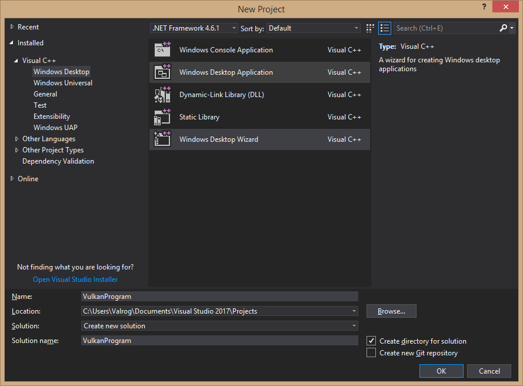
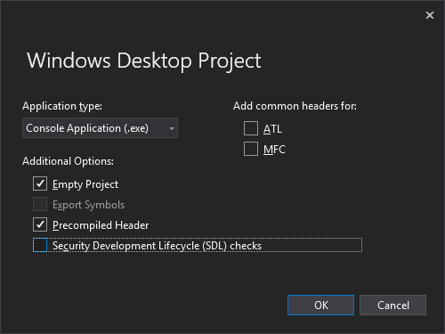
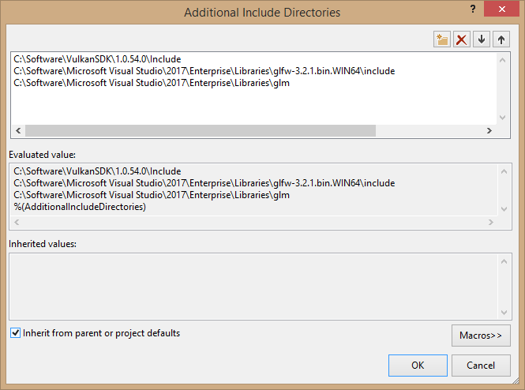
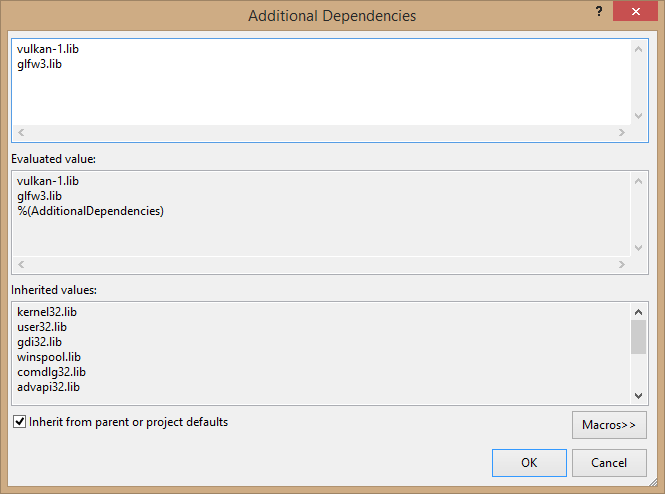

# Vulkan Environment in Visual Studio
This is merely a quick reference guide that will help you set up a Vulkan template for Visual Studio. If you have never done this before, a more detailed and comprehensive guide can be found [here][1], and it is also the main guide which this one is based upon.

# Requirements
It is assumed that the required software is already installed on your system. It is also assumed that your hardware has Vulkan support and your drivers are up to date.

* [Visual Studio 2017][2]
* [Vulkan SDK][3]
* [GLFW utility library][4]
* [GLM mathematics library][5]

# Configuring Visual Studio

Project Templates have been changed in Visual Studio 2017 [Update 15.3][6]. For this setup, a ``Windows Desktop Wizard`` will be used as the foundation.

The new Project Options window now looks like this.

A new ``C++ File (.cpp)`` is added to the ``Source Files``. This will serve as the main file for the Vulkan template.

Sample file is included in this guide and can be used as a starting point.

## Configuring Properties

Visual Studio must be configured to know where to find Vulkan dependencies and directories. These settings can be found under ``Project`` -> ``Properties``. ``All Configurations`` should be selected. Vulkan, GLFW and GLM header directories are included through ``C/C++`` -> ``General`` -> ``Additional Include Directories``.

Under ``Linker`` -> ``General`` -> ``Additional Library Directories``, appropriate Vulkan and GLFW library directories have to be added.

**Note:** Example shows configuring files for ``64-bit`` development. Setup for ``32-bit`` development is equivalent, the main difference is in which files are linked.

Vulkan and GFWL object files are added through ``Linker`` -> ``Input`` -> ``Additional Dependencies``.

## Testing

After compiling the project, the command prompt and a blank window appear on the screen. The number of supported extensions should be non-zero. If the program returns zero, then this means something went wrong during driver or SDK installations. 

# Exporting Template

# Removing Templates

Removing a template from Visual Studio 2017 is done by deleting a template inside the ``ProjectTemplatesCache`` folder. Full path to this folder is located at ``%APPDATA%\Microsoft\VisualStudio\<version_ID>\ProjectTemplatesCache``

[1]: https://vulkan-tutorial.com/Development_environment "Development Environment - Vulkan Tutorial"
[2]: https://www.visualstudio.com/vs/ "Visual Studio IDE"
[3]: https://vulkan.lunarg.com/ "LunarXchange"
[4]: http://www.glfw.org/download.html "GLFW - Download"
[5]: https://glm.g-truc.net/0.9.8/index.html "OpenGL Mathematics"
[6]: https://blogs.msdn.microsoft.com/vcblog/2017/08/15/changes-to-project-templates-and-code-wizards-in-15-3/ "Changes to Project Templates and Code Wizards in 15.3"
